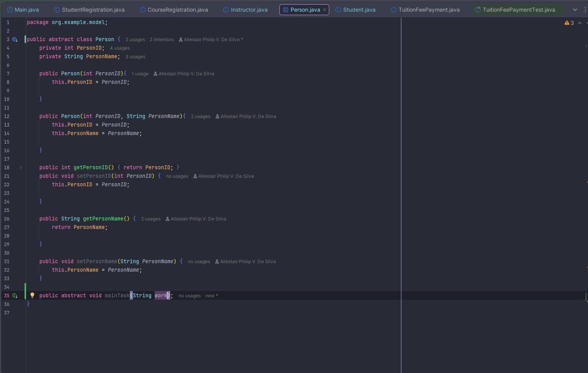
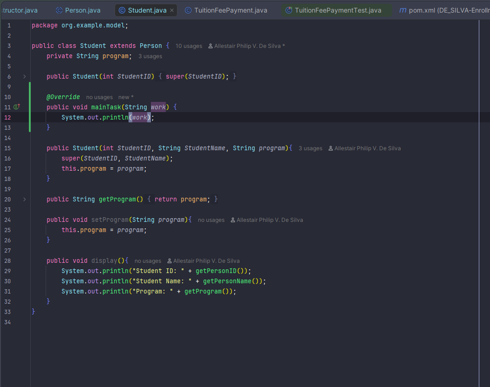
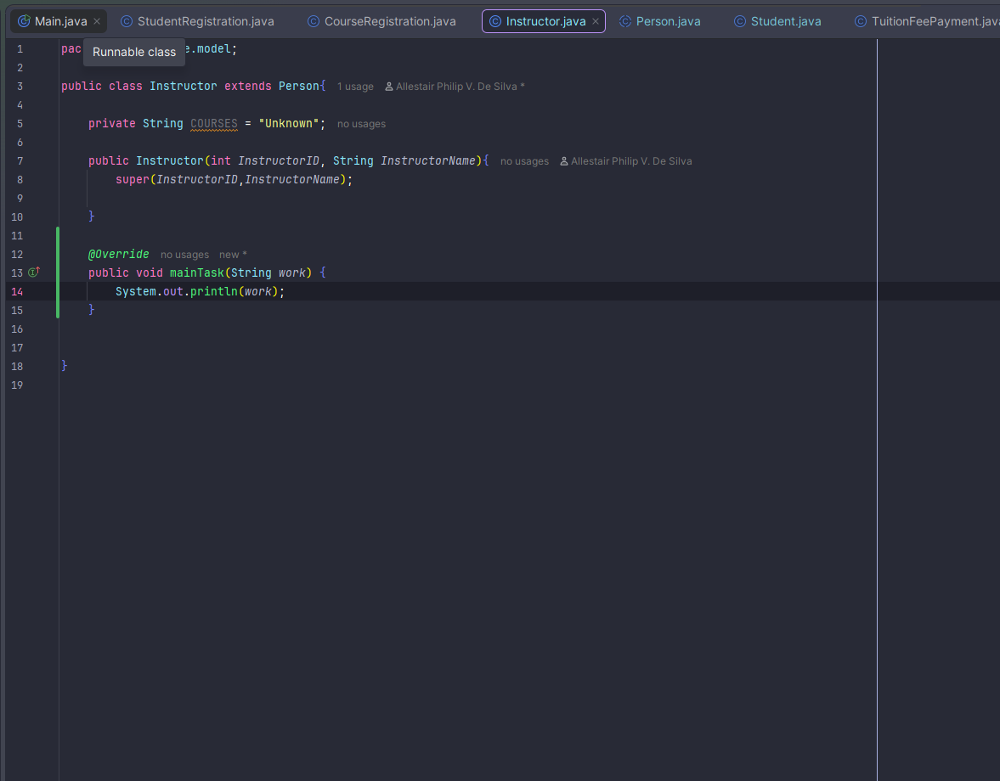

# OOP ENROLLMENT SYSTEM

---
Author: Allestair Philip V. De Silva

## **Encapsulation**

## **Inheritance**

## **Abstraction**
### **Person Class**

### **Student Class**

### **Instructor Class**

## **System Architecture (Data Hierarchy)**

* **Department**: Represents a college/department which contains multiple Sections.
* **Section**: Represents a specific class block. It enforces a `maxCapacity` and links to an assigned `Instructor`, a specific `Course`, and a list of enrolled `Student`s.
* **TuitionFeePayment**: A pure data entity that tracks the financial status, total fees, and amount paid for a specific student.

## **Service Layer (Interfaces & Exceptions)**
The system strictly implements an Interface-Driven Architecture. All business logic is decoupled from data models using interface contracts (e.g., `IStudentService`, `IEnrollmentService`).

**Custom Exceptions:**
To enforce real-world business validations, the system utilizes custom exceptions instead of console printing within the service layer:
* `SectionFullException`: Thrown when an enrollment attempt exceeds a Section's `maxCapacity`.
* `DuplicateIDException`: Thrown when attempting to register an entity with an existing ID.

## **User Interface (CLI) & Exception Handling**
The application now runs on a fully Interface-Driven Console Menu.
* **Separation of Concerns:** The CLI handles all formatting and data presentation directly, fetching pure data from the secure Entities via the `CampusRegistrar` bridge.
* **Robust Error Handling:** The CLI actively catches custom exceptions (like `DuplicateIDException` and `SectionFullException`) using `try-catch` blocks. This ensures the program displays user-friendly error messages and continues running gracefully instead of crashing.